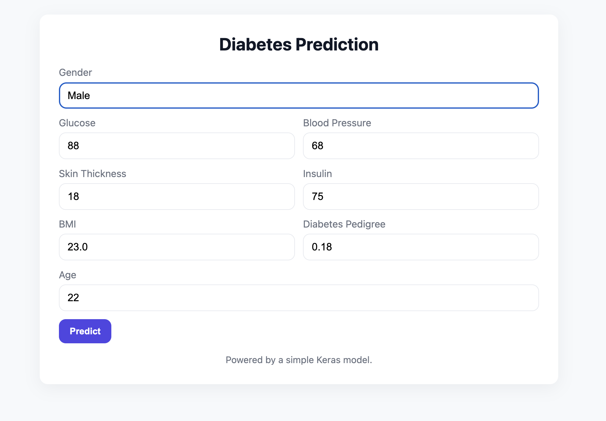
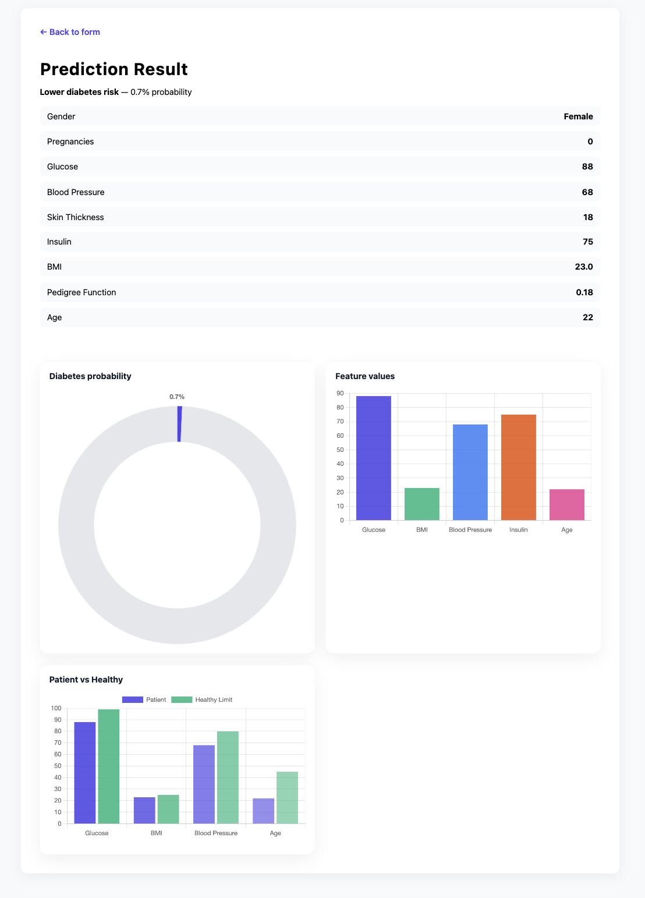
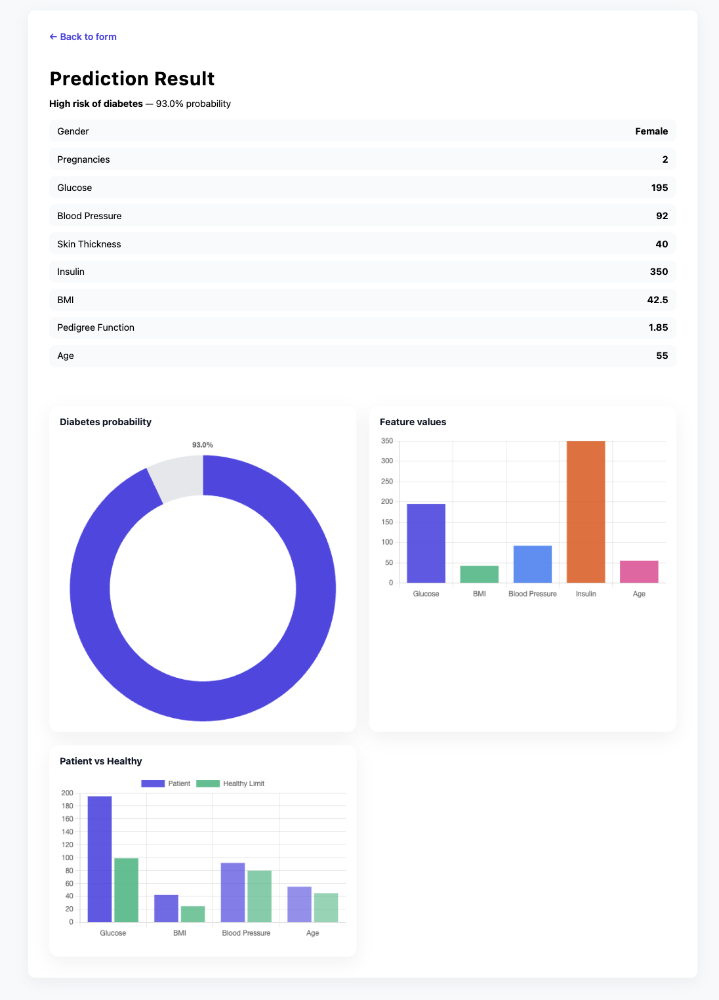

# Diabetes Prediction Using Artificial Neural Networks (ANN)

## Overview

This project uses an Artificial Neural Network (ANN) to predict whether a patient is likely to have diabetes based on medical and demographic information.

The model is trained on the Pima Indians Diabetes Dataset and demonstrates the application of deep learning in healthcare analytics.

---

## Features

* Data preprocessing and feature scaling
* Artificial Neural Network implementation using TensorFlow/Keras
* Model training and evaluation
* Diabetes risk prediction for new patients
* Accuracy and loss visualization
* Confusion matrix and classification report

---

## Dataset

Dataset: Pima Indians Diabetes Dataset

### Input Features

| Feature                  | Description                 |
| ------------------------ | --------------------------- |
| Pregnancies              | Number of pregnancies       |
| Glucose                  | Blood glucose level         |
| BloodPressure            | Blood pressure              |
| SkinThickness            | Triceps skin fold thickness |
| Insulin                  | Insulin level               |
| BMI                      | Body Mass Index             |
| DiabetesPedigreeFunction | Family history factor       |
| Age                      | Age of patient              |

### Target Variable

| Value | Meaning      |
| ----- | ------------ |
| 0     | Non-Diabetic |
| 1     | Diabetic     |

---

## Technologies Used

* Python
* TensorFlow / Keras
* NumPy
* Pandas
* Matplotlib
* Scikit-learn
* Jupyter Notebook

---

## Project Workflow

1. Data Collection
2. Data Preprocessing
3. Feature Scaling
4. Train-Test Split
5. ANN Model Development
6. Model Training
7. Model Evaluation
8. Prediction of New Patient Records

---

## ANN Architecture

Input Layer (8 Features)

↓

Hidden Layer (16 Neurons, ReLU)

↓

Hidden Layer (8 Neurons, ReLU)

↓

Output Layer (1 Neuron, Sigmoid)

---

## Evaluation Metrics

* Accuracy Score
* Precision
* Recall
* F1 Score
* Confusion Matrix
* ROC Curve

---

## Results

The model successfully predicts diabetes risk using patient health records and achieves competitive performance on the dataset.

---

## Screenshots

The following screenshots show the application interface and prediction results:







---

## Sample Prediction

Input:

[6, 98, 58, 33, 190, 34.0, 0.430, 43]

Output:

Probability: 0.18

Prediction: Non-Diabetic

---

## Installation

1. Create and activate a Python virtual environment:

```bash
python3 -m venv venv
source venv/bin/activate
```

2. Install dependencies:

```bash
pip install -r requirements.txt
```

## Training the Model

Run the training script to create the model and scaler files:

```bash
python train.py
```

After training, the following files are created:

- `model.h5`
- `scaler.pkl`

## Running the App

Start the Flask server:

```bash
python app.py
```

Then open:

```text
http://localhost:51999

---
